# Git y GitHub Desde Cero


Aprende Git y GitHub desde fundamentos hasta flujos colaborativos reales, con explicaciones simples, comandos practicos y laboratorios para practicar desde casa.

## Ruta De Aprendizaje

| Bloque | Tema | Ir |
|---|---|---|
| 01 | Fundamentos de control de versiones | [Abrir](#fundamentos-del-control-de-versiones) |
| 02 | Git, GitHub y ramas | [Abrir](#git-github-y-ramas) / [Ramas en Git](#ramas-en-git-trabajo-paralelo-merge-y-conflictos) |
| 03 | Terminal y Linux basico | [Abrir](#terminal-y-linux-basico) |
| 04 | Instalacion y configuracion | [Abrir](#instalacion-y-configuracion-de-git) |
| 05 | Repositorio local y flujo de trabajo | [Abrir](#primer-repositorio-local) |
| 06 | Estados, staging y commits | [Abrir](#estados-staging-y-commits) |
| 07 | Deshacer cambios y `.gitignore` | [Deshacer](#deshacer-cambios-en-git) / [Gitignore](#gitignore-y-buenas-practicas) |
| 08 | Laboratorio y recursos | [Laboratorio](#laboratorio-primer-flujo-local-con-git) / [Recursos](#material-complementario) |

> Este indice se mantendra corto aunque el curso crezca. Cada bloque contiene explicaciones, comandos y diagramas dentro de su propia seccion.

> **Nuevo:** la teoria completa de ramas, merge, conflictos y limpieza esta en [Ramas En Git: Trabajo Paralelo, Merge Y Conflictos](#ramas-en-git-trabajo-paralelo-merge-y-conflictos).

---

## Fundamentos Del Control De Versiones

### Que Problema Resuelve

Antes de existir los sistemas de control de versiones, era comun trabajar con archivos como:

```text
proyecto.zip
proyecto_final.zip
proyecto_final_2.zip
proyecto_ahora_si_final.zip
proyecto_final_corregido.zip
```

Esto generaba:

- Desorden total.
- Perdida de trabajo.
- Imposibilidad de saber quien cambio que.
- Riesgo alto de sobreescribir cambios de otros.

Git evita este desorden guardando la historia real del proyecto de forma automatica.

### Ideas Clave

Un sistema de control de versiones permite:

- **Guardar que cambio**: cada modificacion queda registrada.
- **Guardar cuando cambio**: cada cambio tiene fecha y hora.
- **Guardar quien hizo el cambio**: cada modificacion tiene un autor.
- **Volver a versiones anteriores**: si algo sale mal, puedes regresar.
- **Trabajar en equipo**: varias personas pueden modificar el mismo proyecto sin pisarse.

### Conceptos Importantes

#### Historial

Git construye una linea de tiempo del proyecto. Cada punto en esa linea se llama **commit**.

```text
commit 1: crea estructura inicial
commit 2: agrega login
commit 3: corrige validacion
```

#### Historial Como Linea De Tiempo

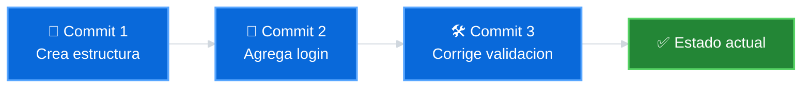

#### Recuperacion

Si algo sale mal, puedes volver a un punto anterior sin perder el trabajo actual.

#### Trazabilidad

Puedes saber:

- Quien hizo un cambio.
- Cuando lo hizo.
- Por que lo hizo (mensaje del commit).

### Evolucion De Los Sistemas De Versiones

#### Copias Manuales

Al inicio, las personas guardaban versiones copiando archivos en disquetes, USB o ZIP.

#### Control Centralizado

Luego surgieron sistemas como SVN donde un servidor central guardaba las versiones. Si el servidor se caia, nadie podia trabajar.

#### Control Distribuido (Git)

Git permite que cada persona tenga una copia completa del historial en su maquina. No dependes de un servidor central para trabajar.

### Por Que Git

- **Rapido**: las operaciones son locales.
- **Seguro**: usa hashes SHA-1 para identificar cada commit.
- **Flexible**: permite trabajar offline y sincronizar despues.
- **Estandar de la industria**: usado por millones de desarrolladores.

---

## Git, GitHub Y Ramas

### Que Es Git

Git es un sistema de control de versiones distribuido, creado por Linus Torvalds en 2005.

- Guarda la historia completa del proyecto en tu maquina.
- Permite crear copias de trabajo llamadas **ramas**.
- Funciona sin necesidad de internet.
- Es gratuito y de codigo abierto.

### Que Es GitHub

GitHub es una plataforma en la nube que almacena repositorios de Git.

- Permite compartir tu codigo con otros.
- Facilita la colaboracion en equipo.
- Ofrece herramientas como Pull Requests, Issues y Actions.
- No es lo mismo que Git.

### Diferencia Entre Git Y GitHub

| Git | GitHub |
|---|---|
| Es un software que instalas en tu maquina | Es un servicio web que almacena repositorios |
| Funciona sin internet | Necesita internet para sincronizar |
| Controla versiones localmente | Permite compartir y colaborar |
| Es gratuito y open source | Tiene planes gratuitos y de pago |

**Analogia**: Git es como Microsoft Word instalado en tu PC. GitHub es como Google Docs, donde compartes y trabajas con otros.

#### Git Local Vs GitHub Remoto

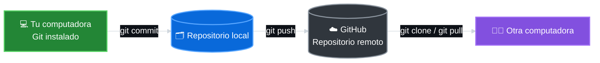

### Relacion Entre Git Y GitHub

El flujo basico es:

1. Trabajas en tu maquina con Git.
2. Envias tus cambios a GitHub con `git push`.
3. Otros descargan tus cambios con `git pull`.
4. Todos colaboran en el mismo proyecto.

### Que Es Una Rama

Una rama es una linea de trabajo independiente dentro del mismo repositorio.

- Te permite experimentar sin afectar el codigo principal.
- Puedes crear ramas para nuevas funcionalidades, correcciones o experimentos.
- Las ramas se pueden fusionar despues.

```text
main (rama principal)
  |
  +-- feature/login (rama para login)
  |
  +-- feature/perfil (rama para perfil)
```

#### Rama Principal Y Rama De Trabajo

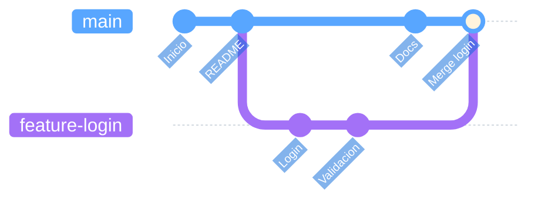

### Ramas En Git: Trabajo Paralelo, Merge Y Conflictos

Hasta ahora, el flujo mas basico de Git es lineal:

```text
modificar -> preparar -> confirmar
```

Eso ya es util porque permite guardar versiones del proyecto. Pero en proyectos reales casi nunca trabajamos solo en una linea recta. Una persona puede estar agregando un menu, otra corrigiendo estilos y otra probando un nuevo encabezado.

Una **rama** permite crear una version paralela del repositorio a partir de un commit. Desde ahi puedes avanzar sin tocar directamente la rama principal.

#### Idea Central

Una rama no es una copia completa del proyecto. En Git, una rama es un **puntero ligero** que apunta a un commit.

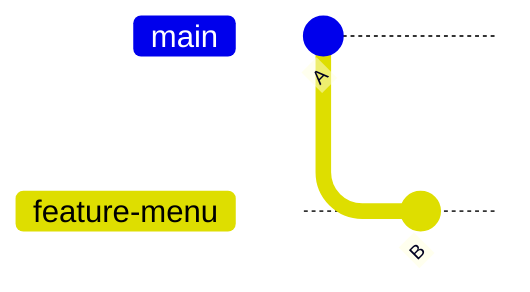

En este ejemplo:

- `A` es el commit base.
- `main` sigue apuntando a `A`.
- `feature-menu` avanzo hacia `B`.
- El trabajo nuevo quedo aislado.

#### La Analogia De La Autopista

El nombre "rama" puede confundir porque pensamos en un arbol. En un arbol real, una rama nace del tronco y normalmente no vuelve a unirse.

En Git es diferente: una rama puede separarse y luego volver a integrarse. Por eso se parece mas a una salida de autopista: sales por una via paralela, avanzas y mas adelante puedes volver a la via principal.

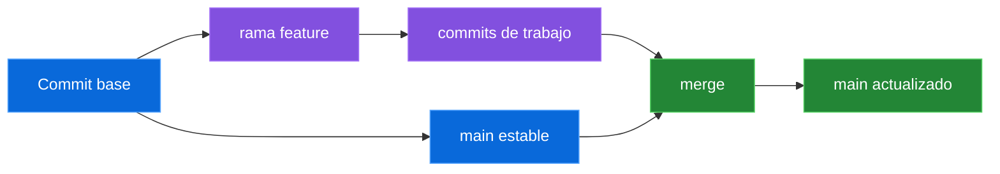

#### Para Que Sirven Las Ramas

Las ramas permiten:

- Trabajar en paralelo.
- Probar ideas sin romper `main`.
- Separar funcionalidades.
- Corregir errores urgentes.
- Revisar cambios antes de integrarlos.
- Mantener limpia la version estable del proyecto.

La rama principal, normalmente `main`, representa la version estable del proyecto. Las ramas como `feature-menu`, `feature-estilos` o `fix-header` suelen ser temporales.

#### Comandos Esenciales De Ramas

Ver las ramas locales:

```bash
git branch
```

Git marca con `*` la rama actual:

```text
* main
  feature-menu
  feature-estilos
```

Mostrar solo el nombre de la rama actual:

```bash
git branch --show-current
```

Crear una rama sin cambiarte a ella:

```bash
git branch fix
```

Cambiarte a una rama existente:

```bash
git switch fix
```

Crear una rama y entrar a ella en un solo paso:

```bash
git switch -c mi-primera-rama
```

Volver a `main`:

```bash
git switch main
```

Ver el historial con ramas:

```bash
git log --oneline --graph --all
```

> Importante: para crear una rama debe existir al menos un commit. Si ejecutas `git init` y aun no has creado ningun commit, Git no tiene un punto base desde donde crear la rama.

#### Flujo Mental Antes De Cambiar De Rama

Antes de moverte entre ramas, revisa el estado:

```bash
git status
```

Si tienes cambios sin guardar, Git puede bloquear el cambio de rama para proteger tu trabajo.

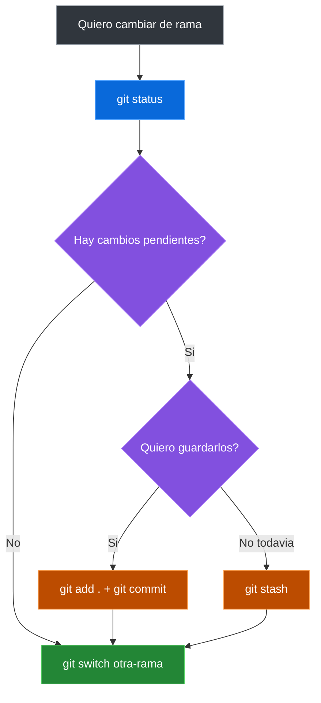

### Escenario Realista: Web De Cafe Aroma

Imagina que tu y otra persona desarrollan la web de **Cafe Aroma**.

La rama `main` representa:

- la version estable,
- el tronco principal del proyecto,
- el estado que no deberia romperse.

Cada nueva funcionalidad se desarrolla en una rama separada.

#### 1. Crear El Proyecto

```bash
mkdir cafe-aroma
cd cafe-aroma
```

#### 2. Inicializar Git Con Rama Main

```bash
git init -b main
```

Git crea:

- un repositorio,
- un historial vacio,
- una rama principal llamada `main`,
- una carpeta oculta `.git`.

La carpeta `.git` guarda commits, ramas, historial y referencias internas.

#### 3. Crear Archivos Iniciales

```bash
touch index.html estilos.css menu.txt
```

Contenido inicial:

```html
<!-- index.html -->
<h1>Cafe Aroma</h1>
```

```text
# menu.txt
- Cafe americano
- Te
```

#### 4. Revisar El Estado

```bash
git status
```

Git mostrara archivos sin rastrear:

```text
Untracked files:
  index.html
  estilos.css
  menu.txt
```

Git piensa en estados:

```text
Working Directory -> Staging Area -> Repository
modificado        -> preparado    -> confirmado
```

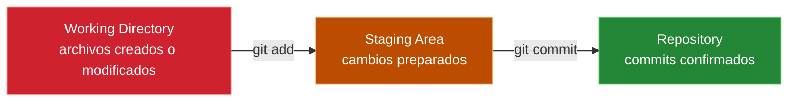

#### 5. Pasar Archivos Al Staging

```bash
git add .
```

Esto significa: "estos cambios si quiero guardarlos en el proximo commit".

#### 6. Crear El Primer Commit

```bash
git commit -m "Proyecto inicial de cafeteria"
```

Un commit no es una carpeta. Es:

- una fotografia del proyecto,
- un punto en el historial,
- una version exacta del estado confirmado.

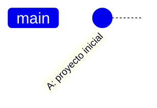

#### 7. Crear Una Rama Para El Menu

```bash
git switch -c feature-menu
```

Git no copio todo el proyecto. Solo creo un nuevo puntero apuntando al mismo commit.

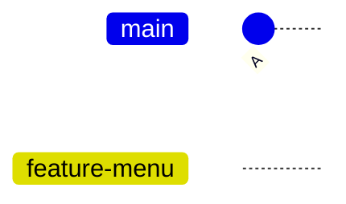

En este punto, `main` y `feature-menu` apuntan al mismo commit.

#### 8. Modificar El Menu

Edita `menu.txt`:

```text
- Cafe americano
- Te
- Capuccino
- Cheesecake
```

Guarda el cambio:

```bash
git add menu.txt
git commit -m "Agregar nuevos productos"
```

Historial:

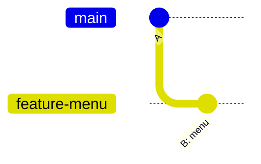

Idea clave:

- `feature-menu` avanzo.
- `main` no cambio.
- La funcionalidad evoluciono aislada.

#### 9. Volver A Main

```bash
git switch main
```

Si al volver a `main` no ves el cheesecake, no se borro nada. Estas viendo la fotografia del commit `A`. Git permite viajar entre versiones del proyecto.

#### 10. Crear Una Rama De Estilos

```bash
git switch -c feature-estilos
```

Edita `estilos.css`:

```css
body {
  background-color: beige;
}
```

Confirma el cambio:

```bash
git add estilos.css
git commit -m "Agregar estilos iniciales"
```

Ahora hay dos lineas de evolucion:

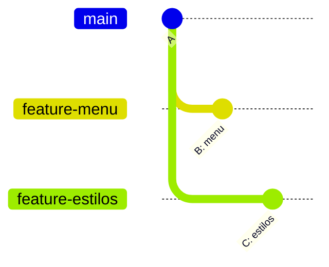

`feature-menu` y `feature-estilos` nacieron desde el mismo punto, pero guardan cambios diferentes.

### Fusionar Ramas Con Git Merge

Fusionar significa traer a la rama actual los cambios que viven en otra rama.

Regla importante:

> `git merge` afecta a la rama donde estas parado.

Por eso primero vuelves a `main`:

```bash
git switch main
```

Fusionar estilos:

```bash
git merge feature-estilos
```

Fusionar menu:

```bash
git merge feature-menu
```

No hubo conflicto porque:

- `feature-menu` modifico `menu.txt`,
- `feature-estilos` modifico `estilos.css`,
- Git puede combinar cambios en archivos distintos automaticamente.

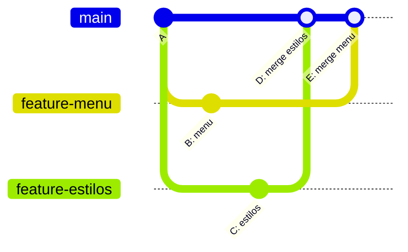

Comandos utiles durante el merge:

```bash
git status
git log --oneline --graph --all
```

### Conflictos De Fusion

Un conflicto ocurre cuando dos ramas modifican la misma zona de un archivo de formas incompatibles.

Git no falla. Git se detiene para pedir una decision humana.

#### 11. Crear Una Rama Para Modificar El Encabezado

```bash
git switch -c feature-header
```

Edita `index.html`:

```html
<h1>Bienvenidos a Cafe Aroma</h1>
```

Confirma:

```bash
git add index.html
git commit -m "Cambiar encabezado"
```

#### 12. Mientras Tanto, Main Cambia La Misma Linea

Vuelve a `main`:

```bash
git switch main
```

Edita la misma linea de `index.html`:

```html
<h1>Cafe Aroma - El mejor cafe de Lima</h1>
```

Confirma:

```bash
git add index.html
git commit -m "Agregar slogan principal"
```

Ahora dos ramas modificaron:

- el mismo archivo,
- la misma linea,
- de maneras distintas.

#### 13. Intentar Fusionar

```bash
git merge feature-header
```

Git mostrara algo parecido a:

```text
CONFLICT (content): Merge conflict in index.html
Automatic merge failed; fix conflicts and then commit the result.
```

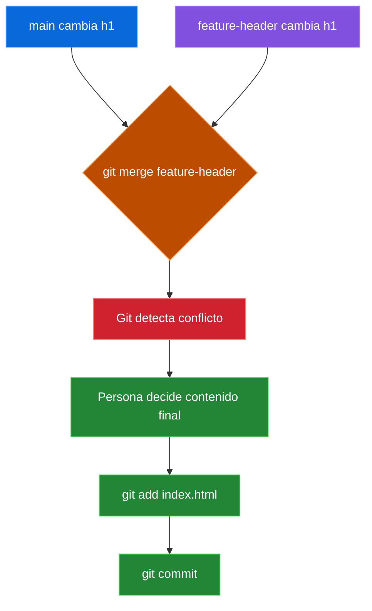

#### 14. Leer Las Marcas De Conflicto

Git deja marcas en el archivo:

```html
 <<<<<<< HEAD
<h1>Cafe Aroma - El mejor cafe de Lima</h1>
 =======
<h1>Bienvenidos a Cafe Aroma</h1>
 >>>>>>> feature-header
```

Como leerlo:

- `HEAD`: lo que existe en la rama actual (`main`).
- `=======`: separa las dos versiones.
- `feature-header`: lo que viene desde la rama que intentas fusionar.

Git esta diciendo: "no se cual decision es correcta; tu decides".

#### 15. Resolver El Conflicto

Decidimos combinar ambas ideas:

```html
<h1>Bienvenidos a Cafe Aroma - El mejor cafe de Lima</h1>
```

Luego eliminamos las marcas:

```text
 <<<<<<<
 =======
 >>>>>>>
```

#### 16. Marcar Como Resuelto

```bash
git add index.html
```

En un conflicto, `git add` significa: "Git, ya resolvi este archivo".

#### 17. Finalizar El Merge

```bash
git commit -m "Resolver conflicto del encabezado"
```

Verifica el historial:

```bash
git log --oneline --graph --all
```

### Eliminar Ramas Que Ya Fueron Fusionadas

Despues de fusionar una rama, normalmente ya no se necesita.

Eliminar ramas ayuda a:

- reducir ruido visual,
- mantener el repositorio ordenado,
- distinguir trabajo activo de trabajo terminado.

Eliminar una rama fusionada:

```bash
git branch -d feature-menu
```

Eliminar otra:

```bash
git branch -d feature-estilos
```

Eliminar la rama del conflicto:

```bash
git branch -d feature-header
```

La opcion `-d` es segura: Git verifica si la rama ya fue fusionada.

Si no fue fusionada, Git puede mostrar:

```text
The branch is not fully merged.
```

Eso significa que podrias perder commits.

Forzar eliminacion:

```bash
git branch -D nombre-rama
```

La `D` mayuscula significa: "eliminala aunque pueda perder cambios".

Usala solo si tienes claro que esos commits ya no importan.

Ver ramas existentes:

```bash
git branch
```

Repositorio limpio:

```text
* main
```

### Comandos De Ramas: Resumen Completo

| Accion | Comando |
|---|---|
| Ver ramas locales | `git branch` |
| Ver la rama actual | `git branch --show-current` |
| Crear una rama | `git branch nombre-rama` |
| Cambiar de rama | `git switch nombre-rama` |
| Crear y entrar a una rama | `git switch -c nombre-rama` |
| Volver a main | `git switch main` |
| Fusionar una rama en la rama actual | `git merge nombre-rama` |
| Ver historial con ramas | `git log --oneline --graph --all` |
| Eliminar rama fusionada | `git branch -d nombre-rama` |
| Forzar eliminacion de rama | `git branch -D nombre-rama` |
| Revisar estado del repo | `git status` |

### Laboratorio Rapido: Cafe Aroma

Ejecuta este flujo completo para practicar ramas sin conflicto:

```bash
mkdir cafe-aroma
cd cafe-aroma
git init -b main

echo "<h1>Cafe Aroma</h1>" > index.html
echo "- Cafe americano" > menu.txt
touch estilos.css

git add .
git commit -m "Proyecto inicial de cafeteria"

git switch -c feature-menu
echo "- Cheesecake" >> menu.txt
git add menu.txt
git commit -m "Agregar producto al menu"

git switch main
git switch -c feature-estilos
echo "body { background-color: beige; }" > estilos.css
git add estilos.css
git commit -m "Agregar estilos iniciales"

git switch main
git merge feature-estilos
git merge feature-menu

git branch -d feature-estilos
git branch -d feature-menu

git log --oneline --graph --all
git status
```

### Ideas Que Deben Quedar Claras

- Una rama nace desde un commit.
- Crear una rama no duplica todo el proyecto.
- `main` debe representar una version estable.
- Una rama permite trabajar en paralelo.
- `git merge` trae cambios de otra rama hacia la rama actual.
- Un conflicto no es un error: es una decision que Git no puede tomar por ti.
- `git add` despues de resolver un conflicto significa "ya lo resolvi".
- Las ramas temporales deben eliminarse despues de fusionarse.

### Main Vs Master

Historicamente, la rama principal se llamaba `master`. Desde 2020, la industria adopto `main` como nombre por defecto.

- Ambos cumplen la misma funcion.
- `main` es el estandar actual.
- Git permite renombrar ramas facilmente.

### Loki, Git Y La Linea Temporal Sagrada

Si viste la serie **Loki** de Marvel, entender ramas de Git te resultara mucho mas facil. La serie usa un concepto llamado la **Linea Temporal Sagrada** que es practicamente una analogia perfecta de como funcionan las ramas en Git.


#### La Linea Temporal Sagrada: Un Repositorio Cosmico

Imagina la Linea Temporal Sagrada como un repositorio de Git gigante, mantenido meticulosamente por la **Autoridad de Variacion Temporal (TVA)**, esos burocratas de cara seria dedicados a preservar el flujo "correcto" del tiempo. Cualquier desviacion de esta linea, conocida como **Evento Nexus**, es como un commit rebelde que podria destruir todo el multiverso.

En Git, tu rama `main` es la Linea Temporal Sagrada: es la version estable y oficial de tu proyecto.

#### Loki, El Pull Request Travieso

Loki, nuestro querido Dios del Engaño, es como un desarrollador travieso que sigue enviando pull requests que rompen todo. El es quien accidentalmente borro la rama master de la Linea Temporal Sagrada, causando todo tipo de caos temporal.

En Git, cuando experimentas en una rama y algo sale mal, no destruiste la rama principal. Solo borras la rama experimental y vuelves a `main`.

#### Ramas De Git: Caminos Divergentes Para La Realidad

Las ramas de Git, por otro lado, divergen intencionalmente de la linea temporal principal, permitiendo a los desarrolladores experimentar sin interrumpir la estabilidad del codigo principal. Una vez que los cambios se consideran estables, pueden fusionarse de vuelta a la rama `main`.

```text
main (Linea Temporal Sagrada)
  |
  +-- feature/experimento (Rama alternativa - Loki causo un Evento Nexus)
  |
  +-- fix/correccion (Rama para arreglar un problema)
```

#### Conflictos De Fusion: Dolores De Cabeza Cosmicos

En la Linea Temporal Sagrada, los Eventos Nexus surgen de desviaciones del curso predeterminado de la historia, alterando potencialmente toda la linea temporal. En Git, los **conflictos de fusion** ocurren cuando cambios en diferentes ramas intentan modificar el mismo archivo, requiriendo resolucion manual.

#### Podar Ramas Y El Reset De La TVA

La costumbre de la TVA de podar ramas, o resetear lineas temporales, es como un desarrollador limpiando su repositorio de Git. Se deshacen de ramas viejas y sin usar que solo ocupan espacio y causan desorden.

En Git:

```bash
# Eliminar una rama que ya no necesitas
git branch -d nombre-rama

# Forzar eliminacion si no esta fusionada
git branch -D nombre-rama
```

#### Git Reset: Un Retcon Cosmico

El comando `git reset` es basicamente un retcon cosmico, permitiendo a los desarrolladores reescribir la historia y deshacer sus errores. Pero al igual que con los viajes en el tiempo, es mejor usar este poder con moderacion, o podrias terminar creando paradojas que podrian desenredar la misma tela de la realidad.

```bash
# Cuidado: esto reescribe la historia
git reset --hard HEAD~1
```

**Advertencia**: al igual que la TVA no deberia abusar del reset, tu no deberias abusar de `git reset --hard`. Usalo solo cuando estes seguro de lo que haces.

#### Dos Lineas Temporales, Un Proposito

Ya sea que estes lidiando con Lineas Temporales Sagradas o ramas de Git, el objetivo es el mismo: **mantener el orden y prevenir el caos**. La Linea Temporal Sagrada asegura que la realidad no se descarrile, mientras que las ramas de Git permiten a los desarrolladores experimentar e innovar sin romper todo.

Asi que la proxima vez que trabajes en un proyecto de Git, recuerda que no solo estas gestionando ramas de codigo; eres un **guardian cosmico**, salvaguardando la integridad de tu codigo. Y quien sabe, quizas algun dia la TVA comience a monitorear nuestros repositorios de Git, asegurandose de que no creemos Eventos Nexus que podrian destruir todo el universo del software.

> **Creditos**: Esta analogia esta basada en el articulo *"Loki, Git, and the Cosmic Retcon"* de [Gaurav Trivedi](https://beingtechnicalwriter.com/sacred-timeline-git/). Publicado en [Being Technical Writer](https://beingtechnicalwriter.com/).

---

## Terminal Y Linux Basico

### Por Que Usar La Terminal

Git se maneja principalmente desde la terminal. Aunque existen interfaces graficas, la terminal te da:

- Control total sobre Git.
- Acceso a todas las funciones.
- Mayor velocidad con practica.
- Compatibilidad con servidores y entornos profesionales.

### Relacion Con DevOps

En el flujo DevOps:

- Linux es la base de la mayoria de servidores.
- Git controla los cambios del codigo.
- Docker empaqueta las aplicaciones.
- Ansible automatiza configuraciones.

Saber moverte en la terminal es fundamental para todos estos cursos.

#### Git Dentro Del Flujo DevOps

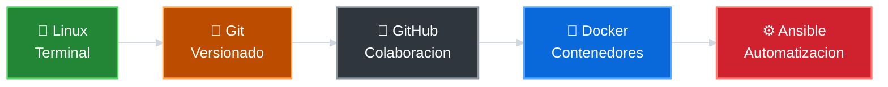

### Comandos Basicos

#### Saber Donde Estas

```bash
pwd
```

Muestra la ruta completa de tu ubicacion actual.

#### Listar Archivos Y Carpetas

```bash
ls
```

Muestra el contenido del directorio actual.

Para ver mas detalles:

```bash
ls -la
```

#### Cambiar De Directorio

```bash
cd nombre-carpeta
```

Para volver al directorio anterior:

```bash
cd ..
```

Para ir a tu home:

```bash
cd ~
```

#### Crear Un Directorio

```bash
mkdir nombre-carpeta
```

#### Crear Un Archivo Vacio

```bash
touch archivo.txt
```

#### Ver El Contenido De Un Archivo

```bash
cat archivo.txt
```

#### Limpiar La Terminal

```bash
clear
```

### Ejemplo De Uso

```bash
pwd
mkdir mi-proyecto
cd mi-proyecto
touch README.md
ls
cat README.md
```

### Recursos Para Practicar

| Recurso | Enlace |
|---|---|
| Practica interactiva de Linux | [KodeKloud Labs](https://kodekloud.com/studio/labs/linux/) |
| Ubuntu CLI Cheat Sheet | [Ver PDF](./recursos/ubuntu-cli-cheat-sheet.pdf) |
| Guia de comandos Linux | [Linux Journey](https://linuxjourney.com/) |

---

## Instalacion Y Configuracion De Git

### Verificar Si Git Esta Instalado

Antes de instalar Git, revisa si ya existe en tu equipo:

```bash
git --version
```

Si aparece una version como `git version 2.43.0`, Git ya esta instalado.

### Instalar Git

#### Windows

1. Descarga el instalador desde [git-scm.com/downloads](https://git-scm.com/downloads).
2. Ejecuta el instalador.
3. Usa las opciones por defecto.
4. Abre **Git Bash** para usar comandos tipo Linux.

#### macOS

```bash
brew install git
```

O descarga desde [git-scm.com/downloads](https://git-scm.com/downloads).

#### Linux (Ubuntu/Debian)

```bash
sudo apt update
sudo apt install git
```

### Configurar Tu Identidad

Git necesita saber quien realiza cada commit.

```bash
git config --global user.name "Tu Nombre"
git config --global user.email "tu@email.com"
```

Esta configuracion se guarda en tu archivo `~/.gitconfig` y se aplica a todos tus repositorios.

### Configurar El Editor Por Defecto

Puedes elegir que editor de texto usara Git para mensajes de commit:

```bash
git config --global core.editor "nano"
```

Opciones comunes:

| Editor | Comando |
|---|---|
| Nano | `git config --global core.editor "nano"` |
| VS Code | `git config --global core.editor "code --wait"` |
| Vim | `git config --global core.editor "vim"` |

### Ver La Configuracion Actual

```bash
git config --list
```

Para consultar un valor especifico:

```bash
git config user.name
git config user.email
```

### Verificar Instalacion

```bash
git --version
git config user.name
git config user.email
```

Si todos los comandos responden correctamente, Git esta listo para usar.

---

## Primer Repositorio Local

### Que Es Un Repositorio Local

Un repositorio local es una carpeta en tu maquina donde Git controla los cambios de los archivos.

- Contiene todo el historial del proyecto.
- Funciona sin necesidad de internet.
- Puedes trabajar en el de forma independiente.

### Que Hace `git init`

El comando `git init` convierte una carpeta normal en un repositorio de Git.

```bash
mkdir mi-proyecto
cd mi-proyecto
git init
```

Al ejecutar `git init`, Git crea una carpeta oculta llamada `.git` que contiene:

- El historial completo del proyecto.
- La configuracion del repositorio.
- Las referencias a ramas y commits.

**Importante**: nunca modifiques manualmente la carpeta `.git`.

### Verificar Que El Repositorio Se Creo

```bash
git status
```

Si ves un mensaje como `On branch main` o `No commits yet`, el repositorio esta listo.

### Directorio De Trabajo

El directorio de trabajo es tu carpeta normal con tus archivos. Git observa esta carpeta y detecta cambios.

```text
mi-proyecto/
├── .git/          (carpeta oculta de Git)
├── README.md      (tu archivo)
└── script.py      (tu archivo)
```

#### Carpeta Visible Vs Cerebro De Git

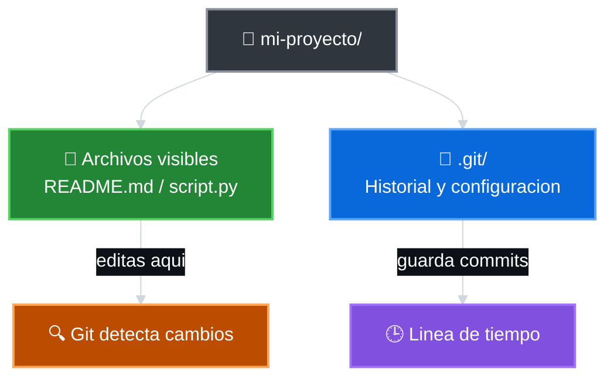

### Crear Un Proyecto Desde Cero

```bash
mkdir mi-proyecto
cd mi-proyecto
git init
touch README.md
git status
```

Ahora tienes un repositorio local con un archivo sin registrar.

### Ver Archivos Ocultos

En Windows, activa "Elementos ocultos" en el explorador para ver `.git`.

En Linux/macOS:

```bash
ls -la
```

Veras la carpeta `.git` en la lista.

---

## Estados, Staging Y Commits

### Los Tres Estados De Git

Git trabaja con tres estados principales:

| Estado | Significado |
|---|---|
| Modificado (Working Directory) | El archivo cambio en tu carpeta de trabajo |
| Preparado (Staging Area) | El archivo esta listo para entrar al proximo commit |
| Confirmado (Repository) | El cambio ya fue guardado en el historial |

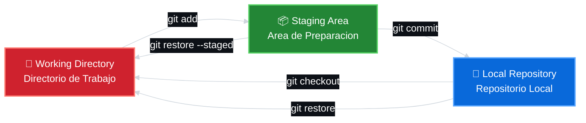

**Como funciona el flujo**:

1. **Working Directory** (rojo): Creas o modificas archivos aqui. Git detecta los cambios pero no los guarda aun.
2. **Staging Area** (verde): Usas `git add` para preparar los cambios que quieres incluir en el proximo commit.
3. **Local Repository** (azul): Usas `git commit` para guardar permanentemente los cambios preparados en el historial.

**Analogia**:

- **Working Directory**: tu taller donde trabajas en los archivos.
- **Staging Area**: la bandeja donde pones lo que quieres enviar.
- **Repository**: la caja fuerte donde se guarda todo de forma permanente.

### Revisar El Estado Del Proyecto

```bash
git status
```

Este comando muestra:

- Archivos modificados (en rojo).
- Archivos preparados (en verde).
- Rama actual.
- Si hay cambios sin preparar.

**Usalo constantemente** antes y despues de cada accion.

### Preparar Cambios

Para mover archivos del directorio de trabajo al area de staging:

```bash
git add archivo.txt
```

Para preparar todos los cambios a la vez:

```bash
git add .
```

Para preparar archivos de un tipo especifico:

```bash
git add *.md
```

### Verificar Antes De Confirmar

```bash
git status
```

Los archivos en verde estan listos para el commit.

### Crear Un Commit

```bash
git commit -m "Agrega README inicial"
```

Un commit es una foto del proyecto en un momento dado.

- Guarda el estado de todos los archivos preparados.
- Incluye autor, fecha y mensaje.
- Genera un identificador unico (hash SHA-1).

#### Commits Y HEAD

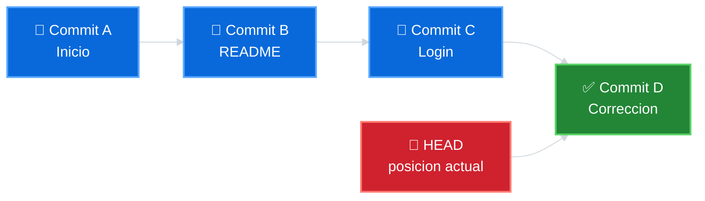

### Ver El Historial

```bash
git log
```

Para ver una version compacta:

```bash
git log --oneline
```

### Commits Atomicos

Cada commit debe representar un solo cambio logico:

- **Bien**: `Agrega validacion de email`
- **Mal**: `cambios varios`

Un commit atomico facilita:

- Revertir cambios especificos.
- Entender el historial.
- Trabajar en equipo.

### Buenos Mensajes De Commit

- Usa imperativo: `Agrega`, `Corrige`, `Elimina`.
- Se conciso pero claro.
- Explica el que y el por que si es necesario.

Ejemplos:

```text
Agrega pagina de login
Corrige error de validacion en formulario
Elimina archivos temporales del repositorio
```

---

## Deshacer Cambios En Git

### Deshacer Modificaciones En Un Archivo

Si modificaste un archivo y quieres volver a la ultima version confirmada:

```bash
git restore archivo.txt
```

Esto descarta los cambios no preparados y restaura el archivo a su ultimo estado en el commit.

### Quitar Un Archivo Del Staging

Si preparaste un archivo por error y quieres sacarlo del area de staging:

```bash
git restore --staged archivo.txt
```

El archivo vuelve al directorio de trabajo pero conserva tus cambios.

### Ver El Estado Despues De Restaurar

```bash
git status
```

### Ejemplo Completo

```bash
# Crear y modificar un archivo
echo "nuevo contenido" >> archivo.txt

# Ver el cambio
git status

# Deshacer el cambio
git restore archivo.txt

# Verificar que volvio al estado anterior
git status
```

### Si Ya Hiciste Commit

Si el cambio ya fue confirmado con `git commit`, puedes:

#### Como Elegir La Forma De Deshacer

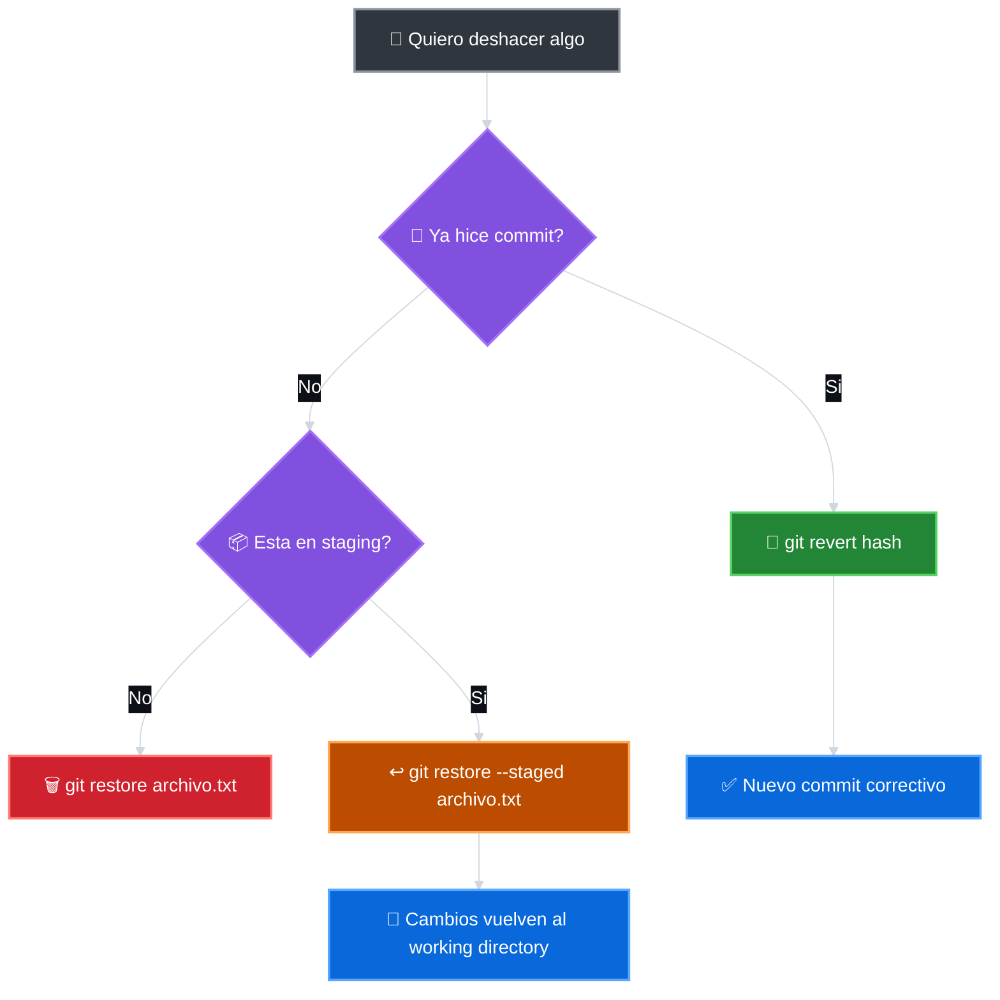

#### Ver El Historial

```bash
git log --oneline
```

#### Revertir Un Commit

```bash
git revert <hash-del-commit>
```

Esto crea un nuevo commit que deshace los cambios del commit especificado, sin borrar el historial.

### Resumen De Comandos

| Accion | Comando |
|---|---|
| Descartar cambios en archivo | `git restore archivo.txt` |
| Quitar del staging | `git restore --staged archivo.txt` |
| Revertir un commit | `git revert <hash>` |
| Ver estado | `git status` |

---

## Gitignore Y Buenas Practicas

### Que Es `.gitignore`

`.gitignore` es un archivo de texto que le dice a Git que archivos o carpetas debe ignorar.

Los archivos ignorados:

- No aparecen en `git status`.
- No se pueden preparar con `git add`.
- No se suben al repositorio.

#### `.gitignore` Como Filtro

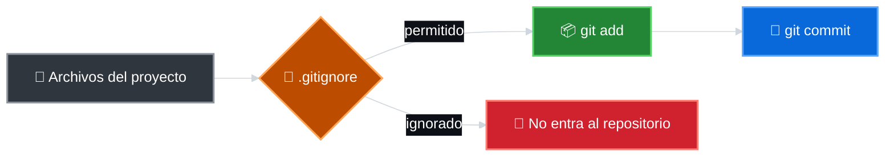

### Que Archivos Ignorar

Ignora archivos que:

- Contienen informacion sensible (contraseñas, tokens, claves).
- Son generados automaticamente (compilados, logs, caches).
- Son especificos de tu maquina (configuraciones locales).
- Son muy pesados o innecesarios (node_modules, dist, build).

### Ejemplos Comunes

```text
# Archivos de entorno
.env
.env.local

# Dependencias
node_modules/
vendor/

# Archivos compilados
*.pyc
*.class
*.o

# Logs
*.log

# IDE
.vscode/
.idea/

# Sistema operativo
.DS_Store
Thumbs.db

# Archivos temporales
*.tmp
*.bak
```

### Crear Un `.gitignore`

```bash
touch .gitignore
```

Edita el archivo y agrega las reglas:

```text
*.log
.env
node_modules/
```

### Verificar Que Funciona

```bash
touch prueba.log
git status
```

Si `prueba.log` no aparece en la lista, `.gitignore` esta funcionando.

### `.gitignore` Global

Puedes crear un archivo global para que aplique a todos tus repositorios:

```bash
git config --global core.excludesFile ~/.gitignore_global
```

Luego crea el archivo `~/.gitignore_global` con tus reglas comunes.

### Buenas Practicas

#### Commits

- Haz commits pequenos y frecuentes.
- Un commit por cambio logico.
- Mensajes claros y descriptivos.

#### `.gitignore`

- Crea `.gitignore` al inicio del proyecto.
- No ignores archivos de configuracion del proyecto (como `package.json`).
- Comparte `.gitignore` en el repositorio.

#### General

- Usa `git status` constantemente.
- Revisa cambios antes de confirmar.
- Mantener el repositorio limpio facilita la colaboracion.
- Nunca subas informacion sensible.

---

## Laboratorio: Primer Flujo Local Con Git

### Objetivo

Practicar el ciclo basico de Git:

```
modificar -> preparar -> confirmar -> revisar
```

### Requisitos

- Git instalado (`git --version`).
- Terminal abierta.
- Configuracion basica (`user.name` y `user.email`).

### Pasos

#### 1. Crear Una Carpeta De Trabajo

```bash
mkdir laboratorio-git
cd laboratorio-git
```

#### 2. Inicializar Git

```bash
git init
```

Verifica con:

```bash
git status
```

#### 3. Crear Un Archivo README

```bash
touch README.md
echo "# Mi Primer Repositorio" >> README.md
```

#### 4. Revisar Estado

```bash
git status
```

Deberias ver `README.md` en rojo (modificado, no preparado).

#### 5. Preparar El Archivo

```bash
git add README.md
```

Verifica:

```bash
git status
```

Ahora `README.md` debe estar en verde (preparado).

#### 6. Crear El Primer Commit

```bash
git commit -m "Agrega README inicial"
```

Verifica:

```bash
git status
git log --oneline
```

#### 7. Modificar El Archivo

```bash
echo "Este es mi primer repositorio con Git." >> README.md
```

Revisa:

```bash
git status
```

#### 8. Preparar Y Confirmar

```bash
git add .
git commit -m "Agrega descripcion al README"
```

Verifica:

```bash
git log --oneline
```

#### 9. Deshacer Un Cambio

Crea un archivo de prueba:

```bash
touch temporal.txt
echo "contenido temporal" >> temporal.txt
```

Preparalo por error:

```bash
git add temporal.txt
git status
```

Quitalo del staging:

```bash
git restore --staged temporal.txt
git status
```

Descarta el cambio:

```bash
git restore temporal.txt
```

#### 10. Crear Un `.gitignore`

```bash
touch .gitignore
echo "*.tmp" >> .gitignore
echo "*.log" >> .gitignore
```

Crea archivos que deben ser ignorados:

```bash
touch prueba.tmp
touch prueba.log
```

Verifica que no aparecen:

```bash
git status
```

#### 11. Commit Final

```bash
git add .gitignore
git commit -m "Agrega gitignore para archivos temporales"
```

#### 12. Verificacion Final

```bash
git status
git log --oneline
```

El repositorio debe estar limpio y con al menos 3 commits.

### Resultado Esperado

Al finalizar, debes tener:

- Un repositorio local funcional.
- Al menos 3 commits con mensajes claros.
- Un `.gitignore` configurado.
- Entendimiento del flujo: modificar, preparar, confirmar.

---

## Material Complementario

| Recurso | Enlace |
|---|---|
| PDF base del material | [Descargar](./material/fundamentos-instalacion-trabajo-local.pdf) |
| Ubuntu CLI Cheat Sheet | [Descargar](./recursos/ubuntu-cli-cheat-sheet.pdf) |
| Practica interactiva de Linux | [KodeKloud Labs](https://kodekloud.com/studio/labs/linux/) |
| Descargar Git | [git-scm.com](https://git-scm.com/downloads) |
| Documentacion oficial de Git | [git-scm.com/doc](https://git-scm.com/doc) |
| Pro Git (libro gratuito) | [git-scm.com/book](https://git-scm.com/book/en/v2) |
