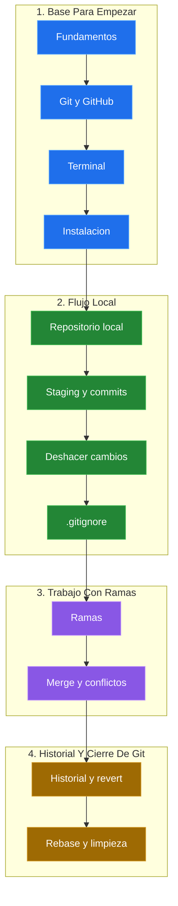

# Git y GitHub Desde Cero

Aprende Git y GitHub desde fundamentos hasta trabajo local, ramas, conflictos, lectura de historial, deshacer cambios y rebase, con explicaciones simples, comandos practicos y laboratorios guiados.

## Ruta De Aprendizaje

| Bloque | Tema | Ir |
|---|---|---|
| 01 | Fundamentos de control de versiones | [Abrir](./clases/01-fundamentos.md) |
| 02 | Git y GitHub | [Abrir](./clases/04-git-y-github.md) |
| 03 | Terminal y Linux basico | [Abrir](./clases/02-terminal-linux.md) |
| 04 | Instalacion y configuracion de Git | [Abrir](./clases/03-instalacion-configuracion.md) |
| 05 | Primer repositorio local | [Abrir](./clases/05-repositorio-local.md) |
| 06 | Estados, staging y commits | [Abrir](./clases/06-estados-staging-commits.md) |
| 07 | Deshacer cambios en Git | [Abrir](./clases/07-deshacer-cambios.md) |
| 08 | .gitignore y buenas practicas | [Abrir](./clases/08-gitignore.md) |
| 09 | Ramas en Git | [Abrir](./clases/10-ramas.md) |
| 10 | Merge y conflictos | [Abrir](./clases/11-merge-conflictos.md) |
| 11 | Historial, inspeccion y deshacer con criterio | [Abrir](./clases/09-historial-revert.md) |
| 12 | Rebase y limpieza de historial | [Abrir](./clases/12-rebase-limpieza-historial.md) |
| Bonus | Loki y la Linea Temporal Sagrada | [Abrir](./clases/13-bonus-loki.md) |

> El indice sigue la linea del PPT: introduccion, entorno Git, flujo local, ramas/merge/conflictos, historial/deshacer y rebase/limpieza de historial.

### Mapa Rapido De La Guia

## Laboratorio

| Laboratorio | Descripcion | Ir |
|---|---|---|
| Terminal y archivos para Git | Practica rutas, carpetas, archivos y preparacion de un proyecto | [Abrir](./laboratorios/terminal-y-archivos-para-git.md) |
| Primer flujo local con Git | Practica el ciclo basico: modificar, preparar, confirmar y revisar historial | [Abrir](./laboratorios/primer-flujo-local-con-git.md) |
| Staging y commits atomicos | Separa cambios por intencion usando `status`, `diff`, `add` y `commit` | [Abrir](./laboratorios/staging-y-commits-atomicos.md) |
| .gitignore, secretos y limpieza | Evita versionar archivos sensibles, logs y temporales | [Abrir](./laboratorios/gitignore-secretos-y-limpieza.md) |
| Deshacer cambios con criterio | Practica `restore`, `restore --staged`, `amend` y `revert` | [Abrir](./laboratorios/deshacer-cambios-con-criterio.md) |
| Ramas y flujo feature | Trabaja una mejora aislada, integrala y elimina la rama temporal | [Abrir](./laboratorios/ramas-flujo-feature.md) |
| Merge con conflicto corto | Practica una fusion con conflicto sobre una misma linea | [Abrir](./laboratorios/merge-con-conflicto-corto.md) |
| Merge vs Rebase corto | Compara historial con merge e historial lineal con rebase | [Abrir](./laboratorios/merge-vs-rebase-corto.md) |
| Ejercicio integrador de Git | Repaso general: commits, ramas, conflictos, restore, amend y rebase | [Abrir](./laboratorios/ejercicio-integrador-git.md) |

## Material De Apoyo

| Material | Descripcion |
|---|---|
| [Slides completos](./material/programa-completo-git-y-github-9na-edicion.pdf) | Slides Completo del curso |

## Recursos Complementarios

| Recurso | Enlace |
|---|---|
| Ubuntu CLI Cheat Sheet | [Ver PDF](./recursos/ubuntu-cli-cheat-sheet.pdf) |
| Practica interactiva de Linux | [KodeKloud Labs](https://kodekloud.com/studio/labs/linux/) |
| Descargar Git | [git-scm.com](https://git-scm.com/downloads) |
| Documentacion oficial de Git | [git-scm.com/doc](https://git-scm.com/doc) |
| Pro Git (libro gratuito) | [git-scm.com/book](https://git-scm.com/book/en/v2) |

El contenido principal de esta guia llega hasta `git rebase` y limpieza de historial. Temas como `stash`, `cherry-pick`, `reflog`, hooks y flujos avanzados de Pull Request quedan como ampliacion para quien quiera seguir profundizando.
