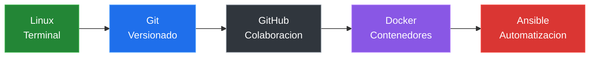

# Terminal Y Linux Basico

## Por Que Usar La Terminal

Git se maneja principalmente desde la terminal. Aunque existen interfaces graficas, la terminal te da:

- Control total sobre Git.
- Acceso a todas las funciones.
- Mayor velocidad con practica.
- Compatibilidad con servidores y entornos profesionales.

## Relacion Con DevOps

En el flujo DevOps:

- Linux es la base de la mayoria de servidores.
- Git controla los cambios del codigo.
- Docker empaqueta las aplicaciones.
- Ansible automatiza configuraciones.

Saber moverte en la terminal es fundamental para trabajar con Git, servidores, contenedores y automatizacion.

### Git Dentro Del Flujo DevOps



## Comandos Basicos

### Saber Donde Estas

```bash
pwd
```

Muestra la ruta completa de tu ubicacion actual.

### Listar Archivos Y Carpetas

```bash
ls
```

Muestra el contenido del directorio actual.

Para ver mas detalles:

```bash
ls -la
```

### Cambiar De Directorio

```bash
cd nombre-carpeta
```

Para volver al directorio anterior:

```bash
cd ..
```

Para ir a tu home:

```bash
cd ~
```

### Crear Un Directorio

```bash
mkdir nombre-carpeta
```

### Crear Un Archivo Vacio

```bash
touch archivo.txt
```

### Ver El Contenido De Un Archivo

```bash
cat archivo.txt
```

### Limpiar La Terminal

```bash
clear
```

## Ejemplo De Uso

```bash
pwd
mkdir mi-proyecto
cd mi-proyecto
touch README.md
ls
cat README.md
```

## Recursos Para Practicar

| Recurso | Enlace |
|---|---|
| Practica interactiva de Linux | [KodeKloud Labs](https://kodekloud.com/studio/labs/linux/) |
| Ubuntu CLI Cheat Sheet | [Ver PDF](../recursos/ubuntu-cli-cheat-sheet.pdf) |
| Guia de comandos Linux | [Linux Journey](https://linuxjourney.com/) |

---

[&larr; Anterior: Fundamentos](./01-fundamentos.md) | [Siguiente: Instalacion y configuracion &rarr;](./03-instalacion-configuracion.md)