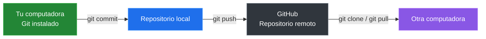

# Git Y GitHub

## Que Es Git

Git es un sistema de control de versiones distribuido, creado por Linus Torvalds en 2005.

- Guarda la historia completa del proyecto en tu maquina.
- Permite crear copias de trabajo llamadas **ramas**.
- Funciona sin necesidad de internet.
- Es gratuito y de codigo abierto.

## Que Es GitHub

GitHub es una plataforma en la nube que almacena repositorios de Git.

- Permite compartir tu codigo con otros.
- Facilita la colaboracion en equipo.
- Ofrece herramientas como Pull Requests, Issues y Actions.
- No es lo mismo que Git.

## Diferencia Entre Git Y GitHub

| Git | GitHub |
|---|---|
| Es un software que instalas en tu maquina | Es un servicio web que almacena repositorios |
| Funciona sin internet | Necesita internet para sincronizar |
| Controla versiones localmente | Permite compartir y colaborar |
| Es gratuito y open source | Tiene planes gratuitos y de pago |

**Analogia**: Git es como Microsoft Word instalado en tu PC. GitHub es como Google Docs, donde compartes y trabajas con otros.

## Git Local Vs GitHub Remoto

## Relacion Entre Git Y GitHub

El flujo basico es:

1. Trabajas en tu maquina con Git.
2. Envias tus cambios a GitHub con `git push`.
3. Otros descargan tus cambios con `git pull`.
4. Todos colaboran en el mismo proyecto.

---

[&larr; Anterior: Instalacion](./03-instalacion-configuracion.md) | [Siguiente: Primer repositorio local &rarr;](./05-repositorio-local.md)