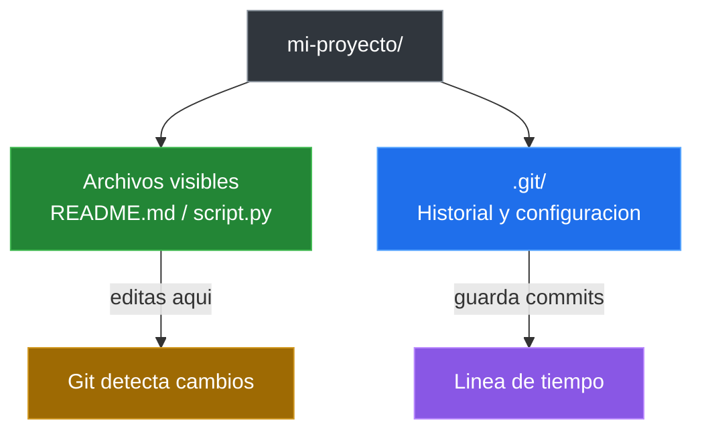

# Primer Repositorio Local

## Que Es Un Repositorio Local

Un repositorio local es una carpeta en tu maquina donde Git controla los cambios de los archivos.

- Contiene todo el historial del proyecto.
- Funciona sin necesidad de internet.
- Puedes trabajar en el de forma independiente.

## Que Hace `git init`

El comando `git init` convierte una carpeta normal en un repositorio de Git.

```bash
mkdir mi-proyecto
cd mi-proyecto
git init
```

Al ejecutar `git init`, Git crea una carpeta oculta llamada `.git` que contiene:

- El historial completo del proyecto.
- La configuracion del repositorio.
- Las referencias a ramas y commits.

**Importante**: nunca modifiques manualmente la carpeta `.git`.

## Verificar Que El Repositorio Se Creo

```bash
git status
```

Si ves un mensaje como `On branch main` o `No commits yet`, el repositorio esta listo.

## Directorio De Trabajo

El directorio de trabajo es tu carpeta normal con tus archivos. Git observa esta carpeta y detecta cambios.

```text
mi-proyecto/
├── .git/          (carpeta oculta de Git)
├── README.md      (tu archivo)
└── script.py      (tu archivo)
```

### Carpeta Visible Vs Cerebro De Git



## Crear Un Proyecto Desde Cero

```bash
mkdir mi-proyecto
cd mi-proyecto
git init
touch README.md
git status
```

Ahora tienes un repositorio local con un archivo sin registrar.

## Ver Archivos Ocultos

En Windows, activa "Elementos ocultos" en el explorador para ver `.git`.

En Linux/macOS:

```bash
ls -la
```

Veras la carpeta `.git` en la lista.

---

[&larr; Anterior: Git y GitHub](./04-git-y-github.md) | [Siguiente: Estados, staging y commits &rarr;](./06-estados-staging-commits.md)