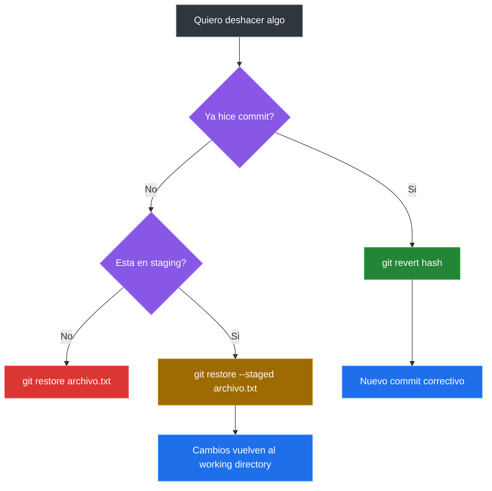

# Deshacer Cambios En Git

## Deshacer Modificaciones En Un Archivo

Si modificaste un archivo y quieres volver a la ultima version confirmada:

```bash
git restore archivo.txt
```

Esto descarta los cambios no preparados y restaura el archivo a su ultimo estado en el commit.

## Quitar Un Archivo Del Staging

Si preparaste un archivo por error y quieres sacarlo del area de staging:

```bash
git restore --staged archivo.txt
```

El archivo vuelve al directorio de trabajo pero conserva tus cambios.

## Ver El Estado Despues De Restaurar

```bash
git status
```

## Ejemplo Completo

```bash
# Crear y modificar un archivo
echo "nuevo contenido" >> archivo.txt

# Ver el cambio
git status

# Deshacer el cambio
git restore archivo.txt

# Verificar que volvio al estado anterior
git status
```

## Si Ya Hiciste Commit

Si el cambio ya fue confirmado con `git commit`, puedes usar `git revert`.

### Como Elegir La Forma De Deshacer



### Ver El Historial

```bash
git log --oneline
```

### Revertir Un Commit

```bash
git revert <hash-del-commit>
```

Esto crea un nuevo commit que deshace los cambios del commit especificado, sin borrar el historial.

## Resumen De Comandos

| Accion | Comando |
|---|---|
| Descartar cambios en archivo | `git restore archivo.txt` |
| Quitar del staging | `git restore --staged archivo.txt` |
| Revertir un commit | `git revert <hash>` |
| Ver estado | `git status` |

---

[&larr; Anterior: Estados, staging y commits](./06-estados-staging-commits.md) | [Siguiente: .gitignore y buenas practicas &rarr;](./08-gitignore.md)