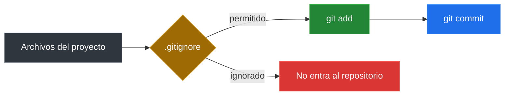

# Gitignore Y Buenas Practicas

## Que Es `.gitignore`

`.gitignore` es un archivo de texto que le dice a Git que archivos o carpetas debe ignorar.

Los archivos ignorados:

- No aparecen en `git status`.
- No se pueden preparar con `git add`.
- No se suben al repositorio.

### `.gitignore` Como Filtro



## Que Archivos Ignorar

Ignora archivos que:

- Contienen informacion sensible (contrasenas, tokens, claves).
- Son generados automaticamente (compilados, logs, caches).
- Son especificos de tu maquina (configuraciones locales).
- Son muy pesados o innecesarios (node_modules, dist, build).

## Ejemplos Comunes

```text
# Archivos de entorno
.env
.env.local

# Dependencias
node_modules/
vendor/

# Archivos compilados
*.pyc
*.class
*.o

# Logs
*.log

# IDE
.vscode/
.idea/

# Sistema operativo
.DS_Store
Thumbs.db

# Archivos temporales
*.tmp
*.bak
```

## Crear Un `.gitignore`

```bash
touch .gitignore
```

Edita el archivo y agrega las reglas:

```text
*.log
.env
node_modules/
```

## Verificar Que Funciona

```bash
touch prueba.log
git status
```

Si `prueba.log` no aparece en la lista, `.gitignore` esta funcionando.

## `.gitignore` Global

Puedes crear un archivo global para que aplique a todos tus repositorios:

```bash
git config --global core.excludesFile ~/.gitignore_global
```

Luego crea el archivo `~/.gitignore_global` con tus reglas comunes.

## Buenas Practicas

### Commits

- Haz commits pequenos y frecuentes.
- Un commit por cambio logico.
- Mensajes claros y descriptivos.

### `.gitignore`

- Crea `.gitignore` al inicio del proyecto.
- No ignores archivos de configuracion del proyecto (como `package.json`).
- Comparte `.gitignore` en el repositorio.

### General

- Usa `git status` constantemente.
- Revisa cambios antes de confirmar.
- Mantener el repositorio limpio facilita la colaboracion.
- Nunca subas informacion sensible.

---

[&larr; Anterior: Deshacer cambios](./07-deshacer-cambios.md) | [Siguiente: Historial y revert &rarr;](./09-historial-revert.md)