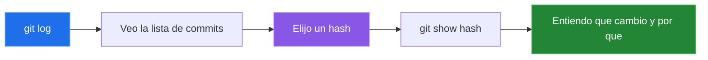
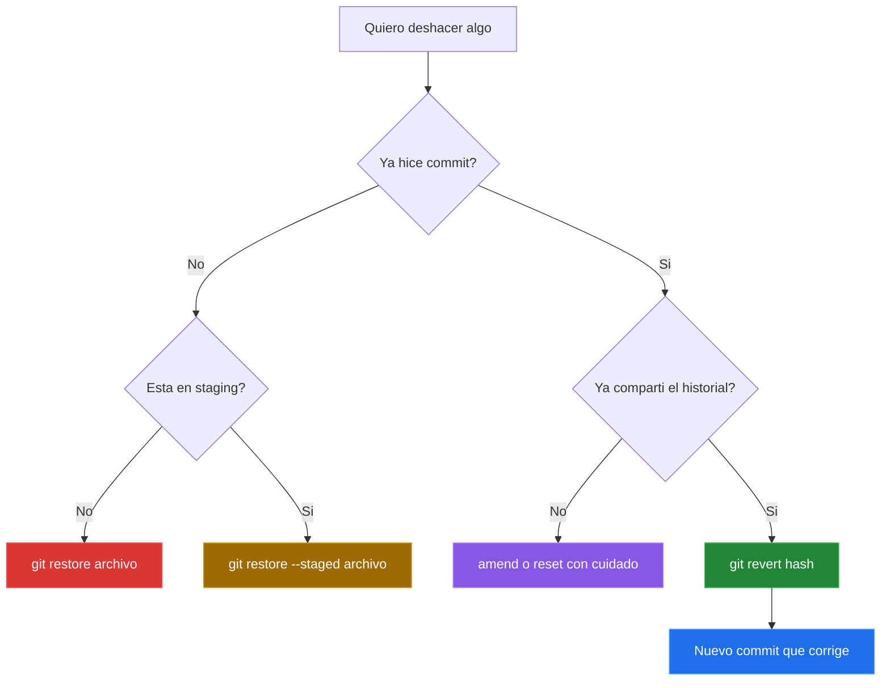

# Historial, Inspeccion Y Deshacer Con Criterio

En este punto ya no basta con saber guardar cambios. Tambien necesitamos leer el historial para entender que paso, comparar modificaciones antes de confirmar y corregir errores sin romper el trabajo de otras personas.

Esta parte prepara el cierre del recorrido: ya sabemos crear commits, movernos con ramas, fusionar trabajo y corregir errores comunes sin perder el control del historial.

## Leer El Historial Como Mapa

El historial no es una lista decorativa. Es la bitacora del proyecto. Si esta bien escrito, te permite reconstruir decisiones tecnicas sin tener que preguntar todo de nuevo.

Comandos utiles:

```bash
git log
git log --oneline
git log --graph --oneline --all
git show <hash>
```



## Comparar Antes De Confirmar

Antes de hacer commit conviene revisar que estamos guardando. Muchas veces el error no esta en Git, sino en hacer commit demasiado rapido.

```bash
git diff
git diff --staged
```

- `git diff` muestra cambios que todavia no estan preparados.
- `git diff --staged` muestra lo que ya entraria al proximo commit.

## Deshacer Con Criterio

No todos los errores se corrigen igual. Primero hay que mirar donde esta el cambio:



Comandos principales de esta parte:

```bash
git restore archivo.txt
git restore --staged archivo.txt
git commit --amend
git reset --mixed HEAD~1
git reset --hard HEAD~1
git revert <hash>
```

La regla practica es simple:

- Si aun no hiciste commit, normalmente se arregla con `restore`.
- Si el cambio esta en staging, primero lo sacas con `restore --staged`.
- Si el commit todavia es tuyo y no lo compartiste, puedes usar `amend` o `reset`.
- Si el historial ya fue compartido, `revert` suele ser la opcion mas sana porque no borra historia.

## Temas Para Seguir Profundizando

Git tiene mas herramientas, pero conviene verlas cuando la base anterior ya este clara. En este curso seguimos con `rebase` y limpieza de historial; despues pueden venir `stash`, `cherry-pick`, `reflog` y hooks.


## Practica De Cierre

Para cerrar la parte de Git local, usa estos ejercicios:

- [Merge vs Rebase corto](../laboratorios/merge-vs-rebase-corto.md): muestra la diferencia entre conservar caminos con `merge` y linealizar historia con `rebase`.
- [Ejercicio integrador de Git](../laboratorios/ejercicio-integrador-git.md): repasa `status`, `add`, `commit`, `diff`, `.gitignore`, ramas, conflictos, `restore`, `amend`, `rebase` e historial.

---

[&larr; Anterior: Merge y conflictos](./11-merge-conflictos.md) | [Siguiente: Rebase y limpieza de historial &rarr;](./12-rebase-limpieza-historial.md)
