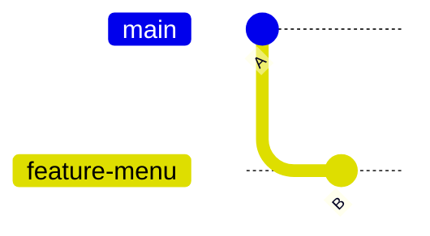
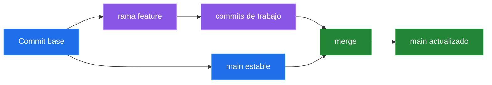
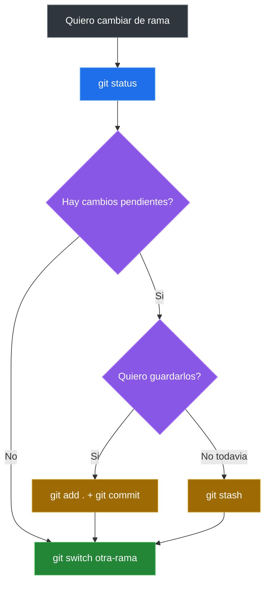
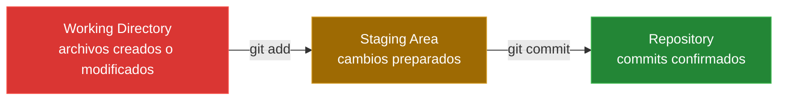
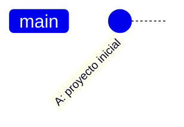
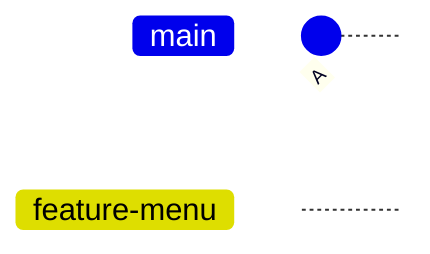
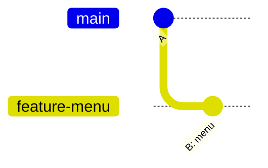
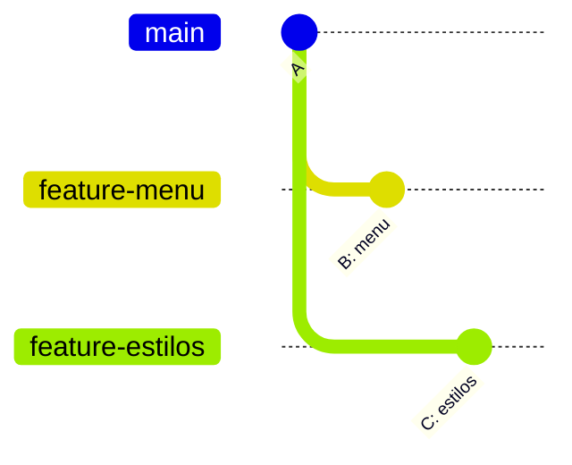

# Ramas En Git

## Que Es Una Rama

Una rama es una linea de trabajo independiente dentro del mismo repositorio.

- Te permite experimentar sin afectar el codigo principal.
- Puedes crear ramas para nuevas funcionalidades, correcciones o experimentos.
- Las ramas se pueden fusionar despues.

```text
main (rama principal)
  |
  +-- feature/login (rama para login)
  |
  +-- feature/perfil (rama para perfil)
```

## Idea Central

Una rama no es una copia completa del proyecto. En Git, una rama es un **puntero ligero** que apunta a un commit.



En este ejemplo:

- `A` es el commit base.
- `main` sigue apuntando a `A`.
- `feature-menu` avanzo hacia `B`.
- El trabajo nuevo quedo aislado.

## La Analogia De La Autopista

El nombre "rama" puede confundir porque pensamos en un arbol. En un arbol real, una rama nace del tronco y normalmente no vuelve a unirse.

En Git es diferente: una rama puede separarse y luego volver a integrarse. Por eso se parece mas a una salida de autopista: sales por una via paralela, avanzas y mas adelante puedes volver a la via principal.



## Para Que Sirven Las Ramas

Las ramas permiten:

- Trabajar en paralelo.
- Probar ideas sin romper `main`.
- Separar funcionalidades.
- Corregir errores urgentes.
- Revisar cambios antes de integrarlos.
- Mantener limpia la version estable del proyecto.

La rama principal, normalmente `main`, representa la version estable del proyecto. Las ramas como `feature-menu`, `feature-estilos` o `fix-header` suelen ser temporales.

## Comandos Esenciales De Ramas

Ver las ramas locales:

```bash
git branch
```

Git marca con `*` la rama actual:

```text
* main
  feature-menu
  feature-estilos
```

Mostrar solo el nombre de la rama actual:

```bash
git branch --show-current
```

Crear una rama sin cambiarte a ella:

```bash
git branch fix
```

Cambiar a una rama existente:

```bash
git switch fix
```

Crear una rama y entrar a ella en un solo paso:

```bash
git switch -c mi-primera-rama
```

Volver a `main`:

```bash
git switch main
```

Ver el historial con ramas:

```bash
git log --oneline --graph --all
```

> Importante: para crear una rama debe existir al menos un commit. Si ejecutas `git init` y aun no has creado ningun commit, Git no tiene un punto base desde donde crear la rama.

## Flujo Mental Antes De Cambiar De Rama

Antes de moverte entre ramas, revisa el estado:

```bash
git status
```

Si tienes cambios sin guardar, Git puede bloquear el cambio de rama para proteger tu trabajo.



## Escenario Realista: Web De Cafe Aroma

Imagina que tu y otra persona desarrollan la web de **Cafe Aroma**.

La rama `main` representa:

- la version estable,
- el tronco principal del proyecto,
- el estado que no deberia romperse.

Cada nueva funcionalidad se desarrolla en una rama separada.

### 1. Crear El Proyecto

```bash
mkdir cafe-aroma
cd cafe-aroma
```

### 2. Inicializar Git Con Rama Main

```bash
git init -b main
```

Git crea:

- un repositorio,
- un historial vacio,
- una rama principal llamada `main`,
- una carpeta oculta `.git`.

La carpeta `.git` guarda commits, ramas, historial y referencias internas.

### 3. Crear Archivos Iniciales

```bash
touch index.html estilos.css menu.txt
```

Contenido inicial:

```html
<!-- index.html -->
<h1>Cafe Aroma</h1>
```

```text
# menu.txt
- Cafe americano
- Te
```

### 4. Revisar El Estado

```bash
git status
```

Git mostrara archivos sin rastrear:

```text
Untracked files:
  index.html
  estilos.css
  menu.txt
```

Git piensa en estados:

```text
Working Directory -> Staging Area -> Repository
modificado        -> preparado    -> confirmado
```



### 5. Pasar Archivos Al Staging

```bash
git add .
```

Esto significa: "estos cambios si quiero guardarlos en el proximo commit".

### 6. Crear El Primer Commit

```bash
git commit -m "Proyecto inicial de cafeteria"
```

Un commit no es una carpeta. Es:

- una fotografia del proyecto,
- un punto en el historial,
- una version exacta del estado confirmado.



### 7. Crear Una Rama Para El Menu

```bash
git switch -c feature-menu
```

Git no copio todo el proyecto. Solo creo un nuevo puntero apuntando al mismo commit.



En este punto, `main` y `feature-menu` apuntan al mismo commit.

### 8. Modificar El Menu

Edita `menu.txt`:

```text
- Cafe americano
- Te
- Capuccino
- Cheesecake
```

Guarda el cambio:

```bash
git add menu.txt
git commit -m "Agregar nuevos productos"
```

Historial:



Idea clave:

- `feature-menu` avanzo.
- `main` no cambio.
- La funcionalidad evoluciono aislada.

### 9. Volver A Main

```bash
git switch main
```

Si al volver a `main` no ves el cheesecake, no se borro nada. Estas viendo la fotografia del commit `A`. Git permite viajar entre versiones del proyecto.

### 10. Crear Una Rama De Estilos

```bash
git switch -c feature-estilos
```

Edita `estilos.css`:

```css
body {
  background-color: beige;
}
```

Confirma el cambio:

```bash
git add estilos.css
git commit -m "Agregar estilos iniciales"
```

Ahora hay dos lineas de evolucion:



`feature-menu` y `feature-estilos` nacieron desde el mismo punto, pero guardan cambios diferentes.

## Comandos De Ramas: Resumen

| Accion | Comando |
|---|---|
| Ver ramas locales | `git branch` |
| Ver la rama actual | `git branch --show-current` |
| Crear una rama | `git branch nombre-rama` |
| Cambiar de rama | `git switch nombre-rama` |
| Crear y entrar a una rama | `git switch -c nombre-rama` |
| Volver a main | `git switch main` |
| Ver historial con ramas | `git log --oneline --graph --all` |
| Revisar estado del repo | `git status` |

## Main Vs Master

Historicamente, la rama principal se llamaba `master`. Desde 2020, la industria adopto `main` como nombre por defecto.

- Ambos cumplen la misma funcion.
- `main` es el estandar actual.
- Git permite renombrar ramas facilmente.

---

[&larr; Anterior: Historial y revert](./09-historial-revert.md) | [Siguiente: Merge y conflictos &rarr;](./11-merge-conflictos.md)