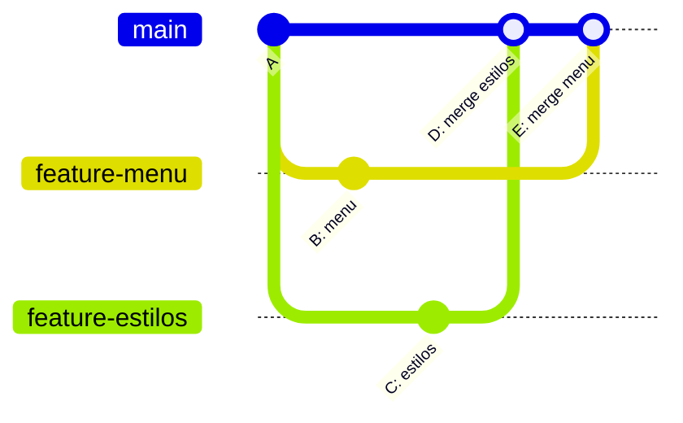
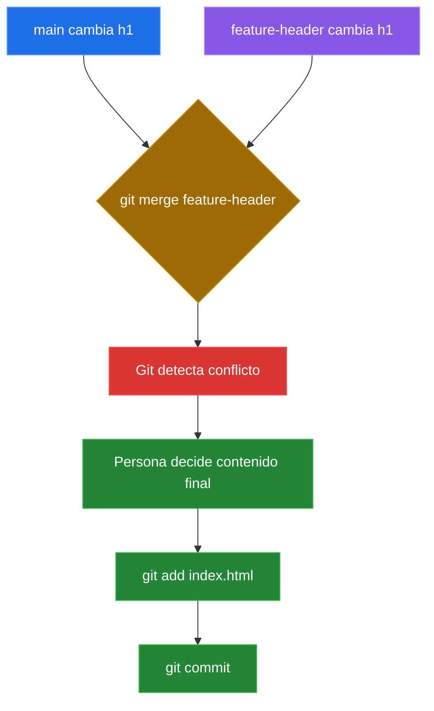

# Merge Y Conflictos

## Fusionar Ramas Con Git Merge

Fusionar significa traer a la rama actual los cambios que viven en otra rama.

Regla importante:

> `git merge` afecta a la rama donde estas parado.

Por eso primero vuelves a `main`:

```bash
git switch main
```

Fusionar estilos:

```bash
git merge feature-estilos
```

Fusionar menu:

```bash
git merge feature-menu
```

No hubo conflicto porque:

- `feature-menu` modifico `menu.txt`,
- `feature-estilos` modifico `estilos.css`,
- Git puede combinar cambios en archivos distintos automaticamente.



Comandos utiles durante el merge:

```bash
git status
git log --oneline --graph --all
```

## Conflictos De Fusion

Un conflicto ocurre cuando dos ramas modifican la misma zona de un archivo de formas incompatibles.

Git no falla. Git se detiene para pedir una decision humana.

### 11. Crear Una Rama Para Modificar El Encabezado

```bash
git switch -c feature-header
```

Edita `index.html`:

```html
<h1>Bienvenidos a Cafe Aroma</h1>
```

Confirma:

```bash
git add index.html
git commit -m "Cambiar encabezado"
```

### 12. Mientras Tanto, Main Cambia La Misma Linea

Vuelve a `main`:

```bash
git switch main
```

Edita la misma linea de `index.html`:

```html
<h1>Cafe Aroma - El mejor cafe de Lima</h1>
```

Confirma:

```bash
git add index.html
git commit -m "Agregar slogan principal"
```

Ahora dos ramas modificaron:

- el mismo archivo,
- la misma linea,
- de maneras distintas.

### 13. Intentar Fusionar

```bash
git merge feature-header
```

Git mostrara algo parecido a:

```text
CONFLICT (content): Merge conflict in index.html
Automatic merge failed; fix conflicts and then commit the result.
```



### 14. Leer Las Marcas De Conflicto

Git deja marcas en el archivo:

```html
 <<<<<<< HEAD
<h1>Cafe Aroma - El mejor cafe de Lima</h1>
 =======
<h1>Bienvenidos a Cafe Aroma</h1>
 >>>>>>> feature-header
```

Como leerlo:

- `HEAD`: lo que existe en la rama actual (`main`).
- `=======`: separa las dos versiones.
- `feature-header`: lo que viene desde la rama que intentas fusionar.

Git esta diciendo: "no se cual decision es correcta; tu decides".

### 15. Resolver El Conflicto

Decidimos combinar ambas ideas:

```html
<h1>Bienvenidos a Cafe Aroma - El mejor cafe de Lima</h1>
```

Luego eliminamos las marcas:

```text
 <<<<<<<
 =======
 >>>>>>>
```

### 16. Marcar Como Resuelto

```bash
git add index.html
```

En un conflicto, `git add` significa: "Git, ya resolvi este archivo".

### 17. Finalizar El Merge

```bash
git commit -m "Resolver conflicto del encabezado"
```

Verifica el historial:

```bash
git log --oneline --graph --all
```

## Eliminar Ramas Que Ya Fueron Fusionadas

Despues de fusionar una rama, normalmente ya no se necesita.

Eliminar ramas ayuda a:

- reducir ruido visual,
- mantener el repositorio ordenado,
- distinguir trabajo activo de trabajo terminado.

Eliminar una rama fusionada:

```bash
git branch -d feature-menu
```

Eliminar otra:

```bash
git branch -d feature-estilos
```

Eliminar la rama del conflicto:

```bash
git branch -d feature-header
```

La opcion `-d` es segura: Git verifica si la rama ya fue fusionada.

Si no fue fusionada, Git puede mostrar:

```text
The branch is not fully merged.
```

Eso significa que podrias perder commits.

Forzar eliminacion:

```bash
git branch -D nombre-rama
```

La `D` mayuscula significa: "eliminala aunque pueda perder cambios".

Usala solo si tienes claro que esos commits ya no importan.

Ver ramas existentes:

```bash
git branch
```

Repositorio limpio:

```text
* main
```

## Comandos De Merge: Resumen

| Accion | Comando |
|---|---|
| Fusionar una rama en la actual | `git merge nombre-rama` |
| Ver estado durante merge | `git status` |
| Ver historial con ramas | `git log --oneline --graph --all` |
| Eliminar rama fusionada | `git branch -d nombre-rama` |
| Forzar eliminacion de rama | `git branch -D nombre-rama` |

## Ideas Que Deben Quedar Claras

- Una rama nace desde un commit.
- Crear una rama no duplica todo el proyecto.
- `main` debe representar una version estable.
- Una rama permite trabajar en paralelo.
- `git merge` trae cambios de otra rama hacia la rama actual.
- Un conflicto no es un error: es una decision que Git no puede tomar por ti.
- `git add` despues de resolver un conflicto significa "ya lo resolvi".
- Las ramas temporales deben eliminarse despues de fusionarse.

## Practica Recomendada

Para practicar el tema en clase o desde casa:

- [Merge con conflicto corto](../laboratorios/merge-con-conflicto-corto.md): ejercicio breve para entender conflictos editando una sola linea.
- [Merge vs Rebase corto](../laboratorios/merge-vs-rebase-corto.md): comparacion visual entre fusionar ramas y reordenar commits.

## Laboratorio Rapido: Cafe Aroma

Ejecuta este flujo completo para practicar ramas sin conflicto:

```bash
mkdir cafe-aroma
cd cafe-aroma
git init -b main

echo "<h1>Cafe Aroma</h1>" > index.html
echo "- Cafe americano" > menu.txt
touch estilos.css

git add .
git commit -m "Proyecto inicial de cafeteria"

git switch -c feature-menu
echo "- Cheesecake" >> menu.txt
git add menu.txt
git commit -m "Agregar producto al menu"

git switch main
git switch -c feature-estilos
echo "body { background-color: beige; }" > estilos.css
git add estilos.css
git commit -m "Agregar estilos iniciales"

git switch main
git merge feature-estilos
git merge feature-menu

git branch -d feature-estilos
git branch -d feature-menu

git log --oneline --graph --all
git status
```

---

[&larr; Anterior: Ramas](./10-ramas.md) | [Siguiente: Historial y deshacer &rarr;](./09-historial-revert.md)
