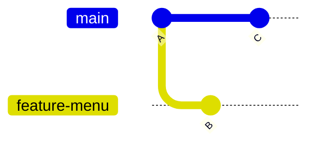
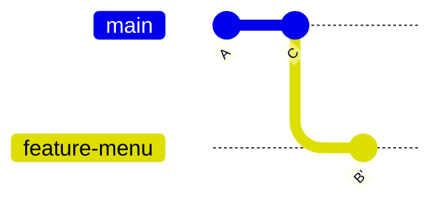
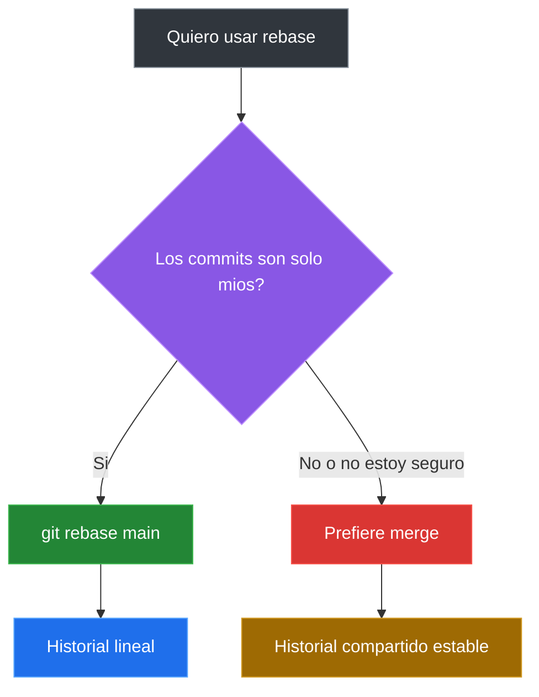

# Rebase Y Limpieza De Historial

`git rebase` permite cambiar la base de una rama. En la practica se usa para actualizar una rama de trabajo con los ultimos commits de `main` y dejar un historial mas lineal antes de integrar cambios.

La idea central no es "hacer magia" con Git. La idea es entender que una rama puede reaplicarse encima de otro punto del historial.

## Que Problema Resuelve

Imagina que creaste una rama para trabajar en una funcionalidad:

```bash
git switch -c feature-menu
```

Mientras avanzabas, `main` tambien recibio nuevos commits. Tu rama quedo atras:



En este punto, `feature-menu` nace desde `A`, pero `main` ya avanzo hasta `C`.

## Rebase Cambia La Base

Al hacer rebase, Git toma los commits de tu rama y los vuelve a aplicar encima del ultimo commit de `main`.

```bash
git switch feature-menu
git rebase main
```

Despues del rebase, el historial se ve mas lineal:



El commit `B'` representa el mismo cambio conceptual que `B`, pero aplicado sobre una base nueva. Por eso el hash cambia.

## Rebase Vs Merge

`merge` conserva explicitamente el punto de union entre dos ramas. `rebase` reconstruye la rama para que parezca que salio desde una base mas reciente.

| Situacion | Comando recomendado | Idea |
|---|---|---|
| Integrar una rama terminada a `main` | `git merge nombre-rama` | Conserva el punto de union |
| Actualizar tu rama local antes de integrar | `git rebase main` | Reaplica tus commits encima de `main` |
| Historial compartido con otras personas | Evita rebase | No reescribas commits ajenos |

## Regla De Oro

No hagas rebase sobre commits que otras personas ya estan usando.

Rebase cambia hashes porque reescribe la historia de la rama. Eso esta bien si la rama es tuya y local. Puede ser un problema si esos commits ya fueron compartidos y otras personas trabajan encima de ellos.



## Conflictos Durante Rebase

Un rebase tambien puede generar conflictos. Si Git no puede reaplicar un commit automaticamente, se detiene para que resuelvas el archivo.

Flujo tipico:

```bash
git status
# editar archivos con conflicto
git add archivo.txt
git rebase --continue
```

Si quieres cancelar el rebase y volver al estado anterior:

```bash
git rebase --abort
```

Comandos utiles durante un conflicto:

| Accion | Comando |
|---|---|
| Ver que falta resolver | `git status` |
| Marcar archivo resuelto | `git add archivo.txt` |
| Continuar el rebase | `git rebase --continue` |
| Cancelar el rebase | `git rebase --abort` |

## Limpiar Antes De Integrar

Antes de integrar una rama, conviene revisar:

```bash
git status
git log --oneline --graph --all
git diff main
```

Preguntas utiles:

- La rama tiene cambios que todavia quiero conservar?
- Los commits cuentan una historia entendible?
- Estoy trabajando sobre la version reciente de `main`?
- Hay conflictos pendientes?

## Resumen De Comandos

| Accion | Comando |
|---|---|
| Cambiar a la rama de trabajo | `git switch mi-rama` |
| Actualizar rama con base en main | `git rebase main` |
| Continuar despues de resolver conflicto | `git rebase --continue` |
| Cancelar rebase | `git rebase --abort` |
| Ver historial lineal y ramas | `git log --oneline --graph --all` |

## Idea Que Debe Quedar Clara

`rebase` no reemplaza a `merge`. Es otra herramienta. Sirve muy bien para ordenar trabajo propio antes de integrarlo, pero debe usarse con cuidado cuando el historial ya fue compartido.

## Laboratorios Relacionados

Estos laboratorios refuerzan la diferencia entre `merge`, `rebase` y la integracion del flujo local:

- [Merge vs Rebase corto](../laboratorios/merge-vs-rebase-corto.md): compara la misma situacion resuelta con `merge` y con `rebase`.
- [Ejercicio integrador de Git](../laboratorios/ejercicio-integrador-git.md): cierra Git local usando commits, ramas, conflictos, deshacer cambios y rebase.

---

[&larr; Anterior: Historial y deshacer](./09-historial-revert.md) | [Siguiente: Bonus - Loki y la Linea Temporal &rarr;](./13-bonus-loki.md)
